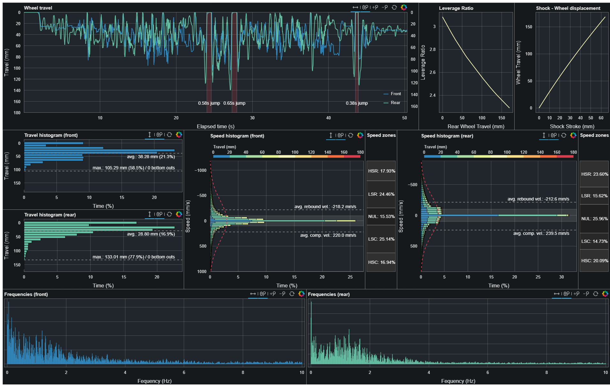

# SST - DIY mountain bike suspension telemetry

Sufni Suspension Telemetry aims to be a cheap MTB fork and shock telemetry solution - mainly to satisfy my curiosity, but maybe somebody else will also find it interesting, or even useful.

## The current state 

As of 2022.08.27., the project uses

 - magnetic rotary encoders (AS5600) to measure distance, that connect to the head unit via phone cables / RJ11 connectors,
 - a Raspberry Pi Pico as "brain", neatly packed into a box with the battery and a not-yet-too-useful display.
 - mechanical parts made of LEGO instead of random quadcopter parts to increase reproducability,
 - a dashboard built with [Bokeh](http://bokeh.org/) to help analyse the data. There's also a utility called `gosst` (written in Go) that performs parts of analysis that were awefully slow with Python.

The dashboard is perhaps the biggest change from previous versions. It contains a number of graphs that should be useful based on my current knowledge of suspension theory. This knowledge mainly comes from sources that deal with automotive of motorcycle suspension - not much concrete information regarding MTBs are out there. I have listed these source at the end of this section.

||
|:--:|
|The new dashboard|

The plots from top to bottom, left to righ:

 - Wheel travel (Front and rear together). Also marks jumps, and displays air time, although this feature is stil rudimentary.
 - Rear wheel travel - Leverage ratio graph (This is input data, not something measured by this project).
 - Shock stroke - rear wheel travel graph.
 - Front and rear travel histogram that also shows averages and maximums (including number of bottom-outs).
 - Front and rear velocity histograms. This also shows the travel distribution for each velocity bin via bar colors. Low-speed zone is marked, and there's a dashed line that show normal distribution. Supposedly, a setup that follows normal distribution more closely should be closer to ideal.
 - Front and rear velocity distribution that displays the time percentage spent in HSR, LSR, zero velocity, LSC and HSC.
 - Front and rear frequencies (FFT of travel)

Finally, some picture of the hardware parts:

||||
|:--:|:--:|:--:|
|Front mech|Front mech closeup|Rear mech|

### Sources

 - [Histograms and Suspension Velocity Analysis](https://www.datamc.org/data-acquisition/suspension-data-analysis/histograms-and-suspension-velocity-analysis/)
 - [How to Set Up a Suspension (Time) Histogram v2](https://pdfcoffee.com/how-to-set-up-a-suspension-time-histogram-v2-pdf-free.html)
 - [Shock Tuning User Guide](https://s100.iracing.com/wp-content/uploads/2021/08/Shock-Tuning-User-Guide.pdf)
 - [Tuning shock absorbers using the shock speed histogram](http://fsae.scripts.mit.edu/motorhead/images/4/4d/Shockspeedarticle.doc)
 - [Histogram Summary Excel sheet](https://www.datamc.org/wp-content/uploads/2019/01/suspension_histograms_v1.0.xlsx)

## History

 I started thinking about this when I was looking for a frame to replace my 2014 Giant Trance, and took a deep dive into frame kinematics and suspension in general. The final push was when I stumbled upon Dougal's [1 Page Suspension Setup Guide](http://www.shockcraft.co.nz/media/wysiwyg/shockcraft_1_page_suspension_setup_guide_v0.pdf) on a [Mara Pro forum](https://www.mtbr.com/threads/manitou-mara-pro.1126919), and the frequency-based suspension setup described in the guide got my attention. I thought it would be cool to graph fork and shock movement in the frequency domain to supplement the guide.

My Clash arrived in April, and that's when I started working on this project. The first version used a [Sharp GP2Y0A41SK0F](https://www.pololu.com/product/2464) IR distance sensor hooked to a Raspberry Pi Zero. This seemed to work OK-ish inside, when I was just pushing down on the handlebar, so replaced the Pi Zero with a [Teensy 3.2](https://www.pjrc.com/store/teensy32.html) microcontroller, and went to the local trails.

||
|:--:|
|IR distance sensor on the bike|

||
|:--:|
|IR distance sensor closeup|

It was a disaster. The data was noisy as hell, and got really unreliable at around 17cm (this is the 4-30 cm version), it was clear it had to go.

Next idea was to use a linear encoder, but they are not cheap, so I decided to use a rotary encoder - the AMS [AS5600](https://ams.com/en/as5600#:~:text=The%20AS5600%20is%20an%20easy,diametric%20magnetized%20on%2Daxis%20magnet.) seemed like a good choice. I was toying with the idea of a rack and pinion solution, but I could not find any suitable, readily available racks so scratched that idea too. I have finally settled on the arrangement you see on the following pictures.

||
|:--:|
|Fork sensor unit with the AS5600 and the Teensy|

||
|:--:|
|Fork sensor unit on the bike|

||
|:--:|
|Fork sensor unit on the bike - closeup|

||
|:--:|
|Shock sensor unit on the bike. The precision bamboo chopstick + electrical tape axle definitely worth a closer look ;) |

As you can see on the pictures, the whole thing is very much in a proof-of-concept state, and most of it is created from scrapped quadcopter parts. It works by attaching two same-length poles connected with a rotating joint to the two moving parts (i.e. the lowers, and the CSU of a fork), thus creating an isosceles triangle. We know the length of the equal sides, so if we measure one angle, we can calculate the distance between the attachment points. To get real distance values, we also need either the starting angle or the starting distance. Both can be measured easily, but right now my code does not implement this calibration; it uses baked-in dummy values instead. Using real values will stretch the graphs in the vertical direction, but it wont affect the overall shape of it.

Back to the electronics. The two AS5600s are connected to the Teensy on I2C, both are sampled 5000 times per second, and data is stored on a MicroSD card. When connected to a USB host, the Teensy appears as an MTP device, and makes the data available without the need of removing the card. This version works quite well, as - hopefully :) - evidenced by the graphs below.

||
|:--:|
|This is me slamming my ass down on the seat while coasting. Low-speed rebound damping was at 0, 4, 8, 12 and 17 clicks on the Mara Pro. These graphs show nicely how osciallation decreases with more damping. It does not disappear though even with LSR fully on, which was a bit of a surprise.|

||
|:--:|
|Some riding around in a parking lot|

||
|:--:|
|Same parking lot, but bouncing around :)|

||
|:--:|
|Parking lot again, this time a bunny hop attempt. You can see how at first I was pedalling seated (only the shock moves), stood up at 4 seconds (fork started moving), compressed a bit after the 8th second (dip on the graph), and jumped (both graphs jump to 0 travel, and stay there for a while).|

This setup was working so well, of course I had to take it apart :) I wanted to replace the Teensy with something much cheaper, and also wanted to pack the whole thing together into one package, without an external battery. The [Raspberry Pi Pico](https://www.raspberrypi.com/documentation/microcontrollers/raspberry-pi-pico.html) seemed like an interesting choice, the documentation also looked quite good, so I decided it will be the brain of the next version. I packed it into a power bank box with one 18650 battery, the MicroSD reader, an on-off switch, and two RJ11 connectors to make the sensor units detachable. The OLED display is currently outside, but I plan to protect it somehow.

||
|:--:|
|The Pico version packed in a power bank box - display side|

||
|:--:|
|The Pico version packed in a power bank box - connector side|

I ported my code from the Teensy with two important changes:

 - This version presents itself as a mass storage device instead of MTP.
 - The Pico has two cores, so one of them collects data, and the other dumps it on the card.
