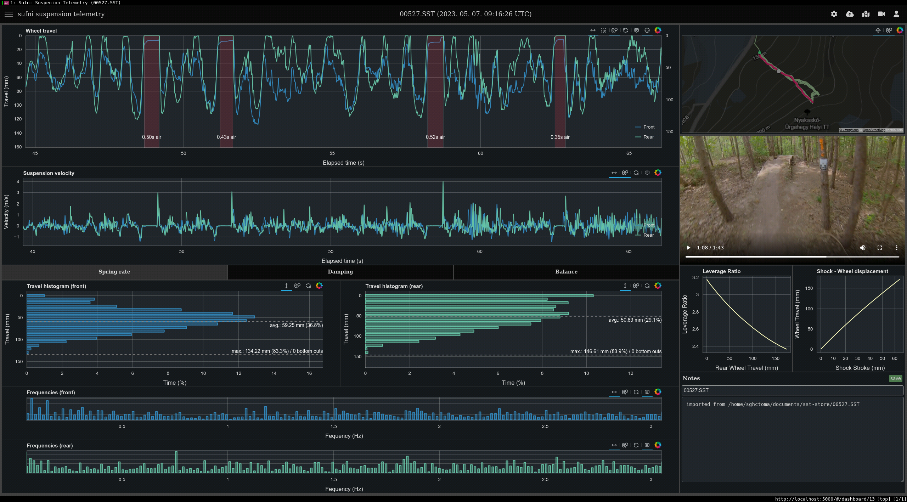

Sufni Suspension Telemetry
==========================

Sufni\* Suspension Telemetry is a mountain bike suspension telemetry system that
was born out of sheer curiosity. The [data acquisition unit](https://github.com/sghctoma/sst/wiki/02-Data-Acquisition-Unit) is built around the
Raspberry Pi Pico W and uses affordable off-the-shelf components, so anybody
with a bit of soldering skills can build it.

Contrary to most (all?) suspension telemetry systems, Sufni uses rotary encoders
to measure movement. They are cheap, reasonably accurate, and can reach pretty
high sample rates. An additional benefit is that on some frames they are easier
to attach to rear shocks than linear sensors, because they can fit into much
tigther spaces.

The DAQ uses a WiFi network to send recorded sessions to the backend server.
When processing is done, data can be analyzed on the [web user interface](https://github.com/sghctoma/sst/wiki/03-Dashboard) that
provides plots useful for setting up the spring rate, damping and the bike's
overall balance. GPX tracks can also be uploaded, and MP4 videos can be opened
from the local machine. These are synchronized to the travel plot, so you can
easily find how your suspension behaved on a certain part of the trail.

The user interface has two additional functionalities:

 - New bike setups can be created, and they can be associated with a DAQ unit
   based on the Pico's uniqe identifer.
 - Normalized (travel percentage, or a number between 0 and 1) data can also be
   [imported](https://github.com/sghctoma/sst/wiki/04-Importing-normalized-data) from CSV files, so you can use the webapp without being tied to
   Sufni's hardware.

Please refer to the wiki for a [quickstart guide](https://github.com/sghctoma/sst/wiki/01-Quickstart-guide), build instructions, and a full
tour on the user interface, plots etc.

\* *The word "sufni" (pronounced SHOOF-nee) means tool shed in Hungarian, but
also used as an adjective denoting something as DIY, garage hack, etc.*
