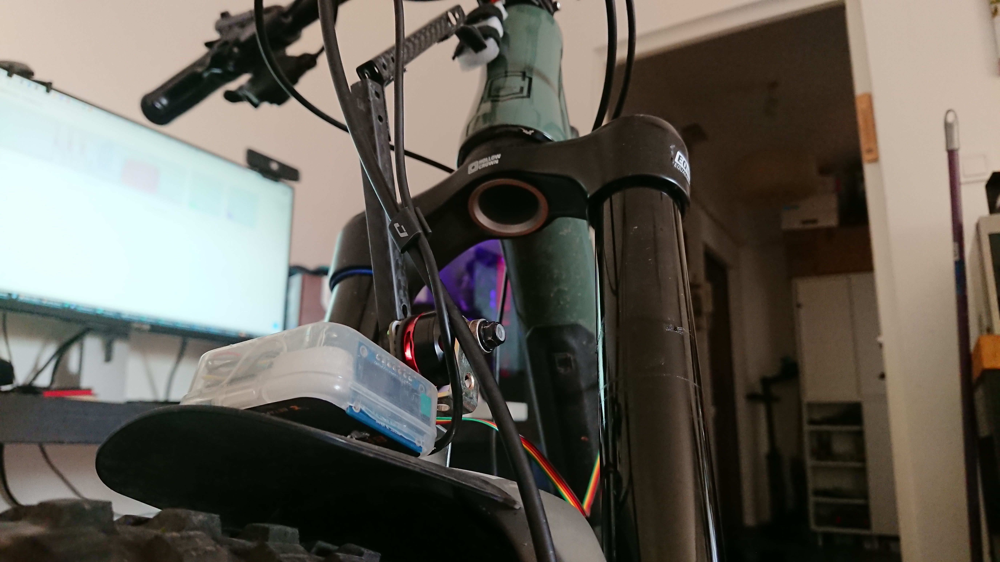
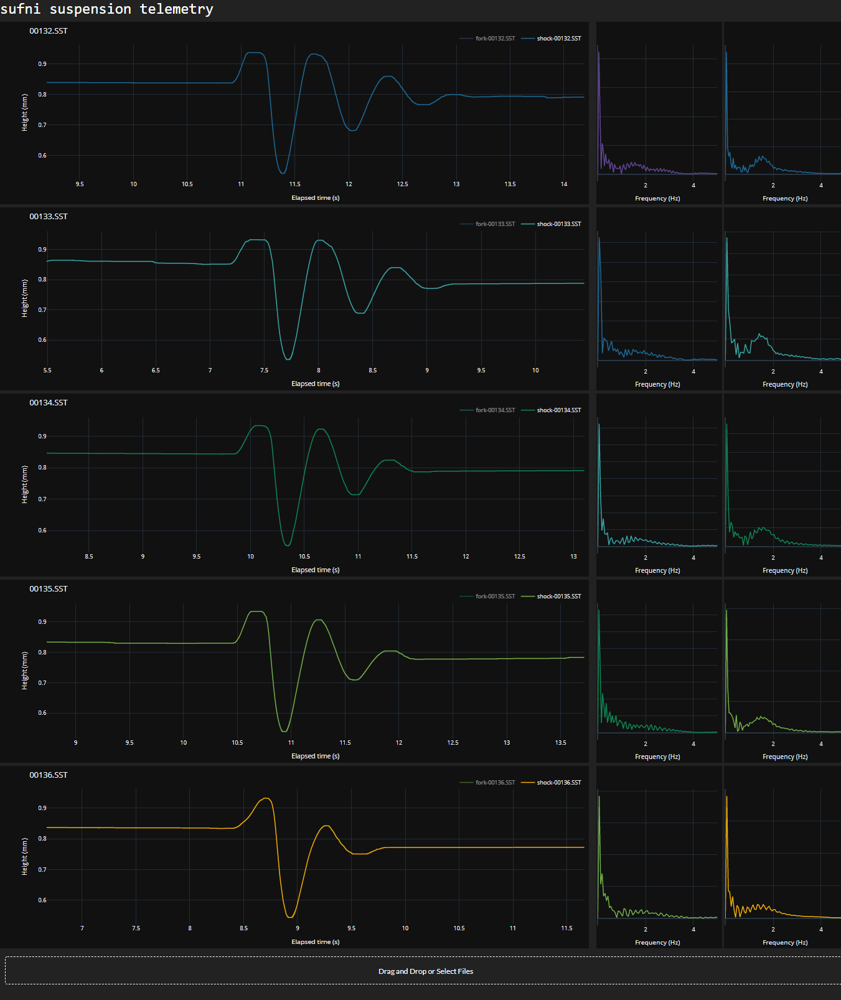
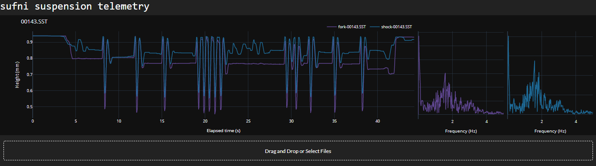
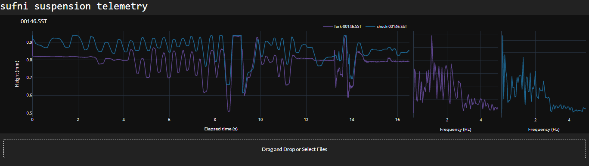

# SST - DIY mountain bike suspension telemetry

Sufni Suspension Telemetry aims to be a cheap MTB fork and shock telemetry solution - mainly to satisfy my curiosity, but maybe somebody else will also find it interesting, or even useful. I started thinking about this when I was looking for a frame to replace my 2014 Giant Trance, and took a deep dive into frame kinematics and suspension in general. The final push was when I stumbled upon Dougal's [1 Page Suspension Setup Guide](http://www.shockcraft.co.nz/media/wysiwyg/shockcraft_1_page_suspension_setup_guide_v0.pdf) on a [Mara Pro forum](https://www.mtbr.com/threads/manitou-mara-pro.1126919), and the frequency-based suspension setup described in the guide got my attention. I thought it would be cool to graph fork and shock movement in the frequency domain to supplement the guide. My Clash arrived in April, and that's when I started working on this project.

The first version used a [Sharp GP2Y0A41SK0F](https://www.pololu.com/product/2464) IR distance sensor hooked to a Raspberry Pi Zero. This seemed to work OK-ish inside, when I was just pushing down on the handlebar, so replaced the Pi Zero with a [Teensy 3.2](https://www.pjrc.com/store/teensy32.html) microcontroller, and went to the local trails.

||
|:--:|
|IR distance sensor on the bike|

||
|:--:|
|IR distance sensor closeup|

It was a disaster. The data was noisy as hell, and got really unreliable at around 17cm (this is the 4-30 cm version), it was clear it had to go.

Next idea was to use a linear encoder, but they are not cheap, so I decided to use a rotary encoder - the AMS [AS5600](https://ams.com/en/as5600#:~:text=The%20AS5600%20is%20an%20easy,diametric%20magnetized%20on%2Daxis%20magnet.) seemed like a good choice. I was toying with the idea of a rack and pinion solution, but I could not find any suitable, readily available racks so scratched that idea too. I have finally settled on the arrangement you see on the following pictures.

||
|:--:|
|Fork sensor unit with the AS5600 and the Teensy|

||
|:--:|
|Fork sensor unit on the bike|

||
|:--:|
|Fork sensor unit on the bike - closeup|

||
|:--:|
|Shock sensor unit on the bike. The precision bamboo chopstick + electrical tape axle definitely worth a closer look ;) |

As you can see on the pictures, the whole thing is very much in a proof-of-concept state, and most of it is created from scrapped quadcopter parts. It works by attaching two same-length poles connected with a rotating joint to the two moving parts (i.e. the lowers, and the CSU of a fork), thus creating an isosceles triangle. We know the length of the equal sides, so if we measure one angle, we can calculate the distance between the attachment points. To get real distance values, we also need either the starting angle or the starting distance. Both can be measured easily, but right now my code does not implement this calibration; it uses baked-in dummy values instead. Using real values will stretch the graphs in the vertical direction, but it wont affect the overall shape of it.

Back to the electronics. The two AS5600s are connected to the Teensy on I2C, both are sampled 5000 times per second, and data is stored on a MicroSD card. When connected to a USB host, the Teensy appears as an MTP device, and makes the data available without the need of removing the card. This version works quite well, as - hopefully :) - evidenced by the graphs below.

||
|:--:|
|This is me slamming my ass down on the seat while coasting. Low-speed rebound damping was at 0, 4, 8, 12 and 17 clicks on the Mara Pro. These graphs show nicely how osciallation decreases with more damping. It does not disappear though even with LSR fully on, which was a bit of a surprise.|

||
|:--:|
|Some riding around in a parking lot|

||
|:--:|
|Same parking lot, but bouncing around :)|

||
|:--:|
|Parking lot again, this time a bunny hop attempt. You can see how at first I was pedalling seated (only the shock moves), stood up at 4 seconds (fork started moving), compressed a bit after the 8th second (dip on the graph), and jumped (both graphs jump to 0 travel, and stay there for a while).|

This setup was working so well, of course I had to take it apart :) I wanted to replace the Teensy with something much cheaper, and also wanted to pack the whole thing together into one package, without an external battery. The [Raspberry Pi Pico](https://www.raspberrypi.com/documentation/microcontrollers/raspberry-pi-pico.html) seemed like an interesting choice, the documentation also looked quite good, so I decided it will be the brain of the next version. I packed it into a power bank box with one 18650 battery, the MicroSD reader, an on-off switch, and two RJ11 connectors to make the sensor units detachable. The OLED display is currently outside, but I plan to protect it somehow.

||
|:--:|
|The Pico version packed in a power bank box - display side|

||
|:--:|
|The Pico version packed in a power bank box - connector side|

I ported my code from the Teensy with two important changes:

 - This version presents itself as a mass storage device instead of MTP.
 - The Pico has two cores, so one of them collects data, and the other dumps it on the card.

Somewhere along the lines I managed to kill one of the AS5600 boards, so this version was not tested outside yet. Of course it works with only one sensor, but I would like the first real test to be a dual-sensor setup. Soon :)

My current TODO list in more-or-less order of importance:

 - Fix and test the Pico version.
 - Create a UI for calibration.
 - Add the ability to specify a leverage ratio curve, and apply it to the shock graph, so that it shows the travel of the rear wheel. Since the Clash has a single-pivot linkage, I'm also thinking about putting the sensor on the main pivot, so that I can directly measure wheel travel. And if I'm interested in the travel of the shock, I can always apply the inverse of the leverage ratio curve.
 - Normalize the fork and shock values to be comparable (i.e. if both of them are on N% of their travel at some point in time, their graph should be at the same value).
 - Design somewhat more decent and universal mechanic parts. The bamboo chopstick axle and the Velcro joints definitely have to go, but the quadcopter motors as sensor axles are something I would like to replace too.

As a long term goal, it would be nice to implement some automatic analysis on the data, but I have to learn a bit more about suspension theory for that. Also, I don't really have the experience to tell apart a good enough and a really good suspension tune, so testing would be somewhat difficult :) 
