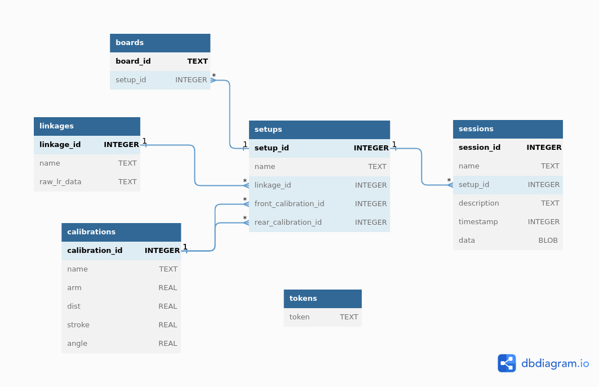
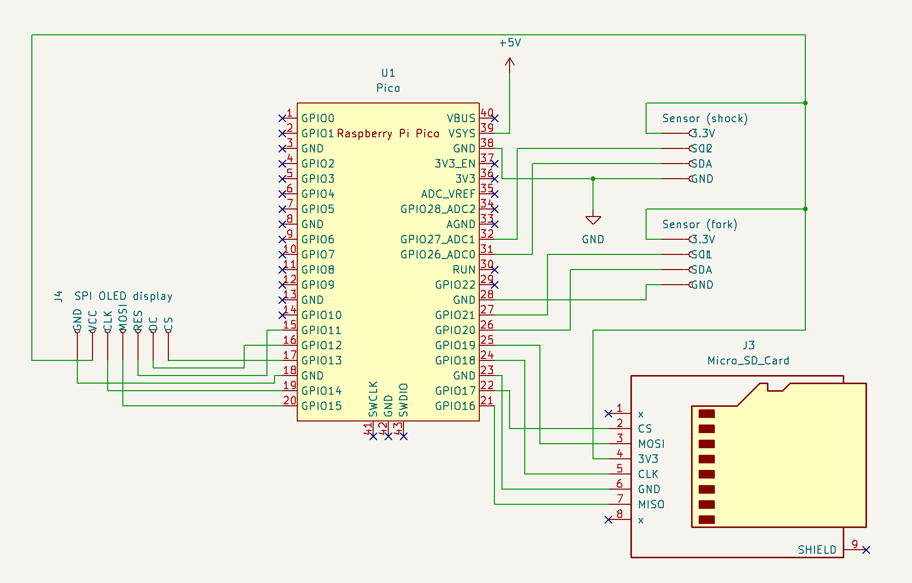
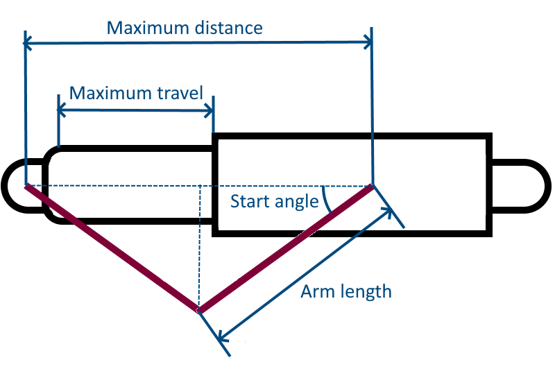
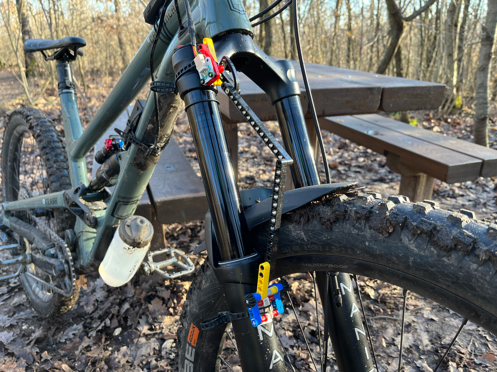
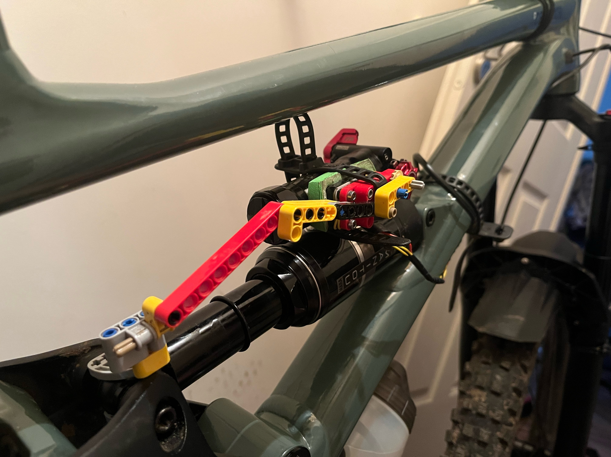
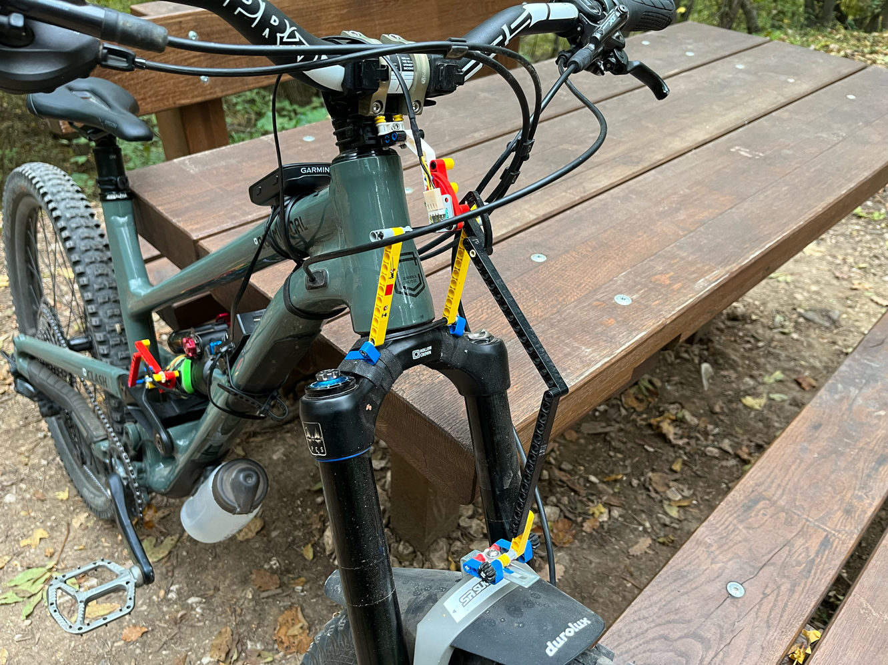

Sufni Suspension Telemetry
==========================

Sufni\* Suspension Telemetry aims to be a very affordable mountain bike
suspension telemetry solution that can be put together with a bit of
soldering and creativity. It consists of four main components:
 
 - The hardware (central unit and sensors).
 - The firmware, currently maintained for the Raspberry Pico W.
 - Preprocessor servers (HTTP and a plain TCP) to upload sessions.
 - A dashboard built around the Bokeh visualization library.

Right now the system is not user friendly, both the software and hardware
need some tinkering, but my goal is to eventually offer a step-by-step guide and
exact parts list so that anyone who can "follow a recipe" is able to make it.
Another big drawback compared to commercial solutions is that I do not have the
years of experience and know-how on translating data to actual pressures /spring
rates and clicks for different forks and shocks. I think this lack of knowledge
on my part can be offset if more experienced riders use telemetry and share their
data though.

I would also like to add that although the system described here works as a
whole, the components are not tightly glued together, and I am planning to make
it possible to use the analyzer part of the package (basically the dashboard)
with arbitrary sensor data (sort of an input plugin system for the preprocessor).

\* *The word "sufni" means tool shed in Hungarian, but also used as an adjective
denoting something as DIY, garage hack, etc.*

**WARNING: This README is quite outdated, a lot has changed recently, and I haven't got the time to update it properly. If you want to build/use the system, feel free to contact me via e-mail for help.**

Dashboard
---------

The dashboard is a web application built around [Bokeh](https://bokeh.org) that
provides various graphs and statistics commonly used for suspension setup
purposes. 


The **time - travel** graph gives an overall picture of suspension movement over
the recorded session. Rear travel is calculated from raw shock movement using the
leverage ratio data of the frame. The graph indicates periods spent in the air (
red overlay) and in stationary position (black overlay). These are excluded from
any statistics calculations. You can select a portion of the graph, which updates
all other graphs to include only the selected period. By default, the dashboard
displays only every 5th datapoint for performance reason, but this can be
configured with the `lod` query string parameter (e.g.`/dashboard?session=1&lod=1`
will display every datapoint).


**Travel histograms** show what percentage of the total time was spent in a given
5% long travel range. This graph can be used to evaluate and adjust suspension
spring rate and progression. Knowing the **average and maximum travel** helps
this assessment, so they are shown on the graph too, along with the **number of
bottom-outs**.

This whole project started with [ShockCraft's 1 Page Suspension Setup Guide](https://www.shockcraft.co.nz/technical-support/setup-suspension/1-page-suspension-setup-guide),
because I wanted to quantify suspension frequencies (I do not necessarily trust
my sense of rythm :) ), so it was obbious from the get-go that the dashboard
will include a graph that represents the data in the frequency domain. These
**Frequency diagrams** display the Fourier-transformation of the time - travel
data. I do not think this graph is really useful for a full run, but when
filtered for e.g. a few bounces, it can show spring rate difference  between
the front and back, and it also might be useful when changing suspension (you
can aim for a frequency that was good for the previous one).

The previous two graphs deal with spring rate, the next ones are helpful for
damping setup. Damping relates to shaft velocity, so we need to use the first
derivative of the time - travel data. Similarly to their travel counterparts,
**Speed histograms** display what percentage of the total time was spent in a
given 50 mm/s velocity range, and also show the **average and maximum shaft
velocity** for both compression (positive values, bottom half of the graph)
and rebound (negative values, top half of the graph). Bar colors represent
travel range percentages for a given velocity range (so they are basically
another histogram). I have not found explicitly MTB-specific information
on suspension speed histograms, but all the automotive and motorcycle
suspension tuning guides use them. The main goal here is to make the graph
as symmetric as possible - this is the reason the normal distribution
curve is overlayed (dashed red line) as a sort of visual aid. Besides the
histogram, displaying what time percentage was spent in the HSR, LSR, LSC and
HSC ranges is also common. The **Speed zones** bars next to the histograms
does exactly this. One thing to note here is that the low speed - high speed
threshold is set to 100 mm/s based on motorcycle guides and trying to analyze
my data, but I have no idea how close it is to the value suspension designers
aim for. Therefore, this value is also configurable with a query string
parameter called `hst` (high-speed threshold).

The last pair of graphs are present only when a session has data from both
the front and rear sensors. The reason is, that these **Velocity balance**
graphs aim to show the balance between the front and rear for compression
and rebound. I have first seen in a forum post that a travel - velocity
graph could be very useful for this purpose, and then I found a bit more
information in a [MotionIQ blog post](https://motioninstruments.com/blogs/blog/the-science-of-using-data-to-tune-modern-mountain-bikes).
Each dot represent a compression or a rebound event, the vertical axis showing
the maximum velocity during the event, and the horizontal axis showing the at
what travel percentage that maximum velocity occured. The lines are trend lines
fitted on the dots, and the closer they are to each other, the more balanced
the front and rear suspension is.

A **Leverage ratio** graph is also displayed on the dashboard as well as a
textbox with arbitrary comments and the session's name.

The dashboard currently does not have a full-blown authentication and
authorization subsystem. It is a read-only interface unless you have a valid
API token sent as the `X-Token` HTTP header, in which case you have access to
the following functionality:

 - You can import sessions from raw data files.
 - You can modify session names.
 - You can edit session comments.
 - You can delete sessions.

Central unit
------------

The central unit collects data from the sensors, and stores them on a MicroSD
card. The card is also used to store a configuration file in the root directory
called `CONFIG` with the following default content:

```
SSID=sst
PSK=changemeplease
NTP_SERVER=pool.ntp.org
SST_SERVER=40.68.254.87
SST_SERVER_PORT=557
```

These default values are also used when the configuration file does not exist.

 When started, the display will show a clock with a dummy time (13:37:00). A
***long press of the right button*** will initiate a time synchronization with
the time server specified as `NTP_SERVER`. This is done via a WiFi connection
for which the network name and password are specified in the config file as
well (`SSID` and `PSK`).

A ***short left press*** will start a session, during which the display will show
which of the two sensors are available (e.g. "`REC:F|S`" for both, "`REC:F|.`" for
fork only). A second ***short left press*** will end the session.

A ***long left press*** will try to upload all not yet uploaded sessions to the
server specified by `SST_SERVER` and `SST_SERVER_PORT` (default values are my
own server). The session file currently uploading is shown on the display, and
there is a summary at end of the process showing how many sessions the unit
tried to upload (" `A:n`"), and how many of those were a success ("`S:m`").

A ***short right press*** will send the unit to a low-energy sleep mode, from
which another ***short right press*** wakes it up.

If the unit is powered down (battery removed) and connected to a computer via
USB while keeping the left button pressed, it will act as a mass storage device,
and gives read-write access to the content of the MicroSD card. During this, the
display will show "`MSC MODE`".

Preprocessor
------------

Initial calculations (where raw sensor data is transformed into millimeters)
were painfully slow in Python, so I separated that functionality into a native
executable, the so-called preprocessor. Since then, `gosst` received a bit more
functionality (e.g. calculates speed, precalculates histograms), and it exposes
this functionality via two servers. The first one is an HTTP API that basically
gives access to the underlying database, and is currently used by the dashboard
to import sessions. The database looks like this:



A **setup** describes a bike: it consist of a **linkage** which is the leverage
ratio data for the frame, and a front and rear **calibration** which describe
sensor setup (more on that later). The information contained in a **setup**
is used to preprocess the **session** data.

The second server allows the central unit to upload sessions over a simplistic
protocol. This is the server specified in the configuration file as `SST_SERVER`
and `SST_SERVER_PORT`. Since the upload process is not interactive, we have to
have an association between a particular central unit and a **setting**. This
is what the **boards** table is for: it contains Pico board identifier (obtained
with `pico_get_unique_board_id()`) - **setup** id pairs.

The **tokens** table contains API
tokens for a very rudimentary authorization control, and it has nothing to do
with `gosst`.

Building from source
====================

Prerequisities
--------------

In order the build sst's components, you wil need 

 - Python3, pip and venv for the dashboard
 - [Raspberry Pico SDK](https://github.com/raspberrypi/pico-sdk) for the firmware
 - Go compiler for `gosst`

Please refer to your OS/package manager documentation on how to install these. With
all the prerequisities installed, you can get the source, and start buliding the components.

```
$ git clone --recurse-submodules https://github.com/sghctoma/sst
```

Gosst
-----

```
$ cd sst/gosst
$ make
```

Dashboard
---------

```
$ cd sst/dashboard
$ python3 -mvenv venv
$ . ./venv/bin/activate
$ pip install -r requirements.txt
```

Firmware
--------

First you need to adjust `include/pin_config.h` to reflect the hardware setup -
basically which peripheral is connected to which GPIO pins. The default setup
follows the arrangement show in the Using the hardware section. After the
adjustment you can build and install the firmware:

```
$ cd sst/firmware/pico-w
$ mkdir build
$ cd build
$ cmake ..
$ make -j4
````

Hardware setup
==============

You will need the following electronics components to mirror the central unit
I'm using:

 - Raspberry Pi Pico W
 - 2 AS5600 rotary encoders
 - 2 pairs of 4-pin JWPF connectors
 - SPI MicroSD card reader + card
 - 2 push buttons
 - SPI OLED display
 - battery



The previously compiled firmware needs to be loaded to the Pico:
```
$ cd sst/firmware/pico-w
$ sudo picotool load sufni-suspension-telemetry.uf2
```

Sensors
-------

Since I'm using rotary encoders to measure distance, sensor setup needs to be
done carefully - this is a big drawback compared to linear encoders, but the
price difference does worth it in my opinion (AS5600 boards are a few dollars).

We want to create an isosceles triangle according to the following sketch:



Care must be taken that the line between the two attachment points is
parallel to the shaft movement vector, and the maximum distance and arm
length must be known.

*These two values are used to calculate the start angle. The rotation
measured by the rotary encoder is added to this start angle, and the result is
used to calculate the leg adjacent to the angle. Subtracting the leg's double
from the maximum distance gives us the shaft travel.*

I have used LEGO pieces for the mechanical parts as a proof-of-concept, but
eventually there will be properly designed attachment hardware. A few pictures
of my setups:







Running the servers
===================

The backend consists of three parts: the dashboard, the HTTP API and the SST
server.

Start the `gosst` servers
-------------------------

```
$ sudo sst/gosst/gosst-tcp <path-to-sqlite-db>
$ sst/gosst/gosst-http <path-to-sqlite-db>
```

Please note that `gosst-tcp` listens on 0.0.0.0:557, which means on *nix-like
systems you need root permission to run it (or, on Linux, the binary needs to
have the `CAP_NET_BIND_SERVICE` capability). The HTTP API listens on
127.0.0.1:8080, so no need for root with that.

Populate the database
---------------------

Starting either of these creates the database schema, but for the system to
work, at least one **setup** has to exist.

### Create a **linkage**

For this, you will need leverage ratio data for your frame as 
"`travel in mm`,`leverage ratio`" pairs separated by newlines. For my bike,
I have used [graphreader.com](http://www.graphreader.com/) on an
[LR graph screenshot](https://ep1.pinkbike.org/p5pb22577901/p5pb22577901.jpg\n0)
I've found online. The screenshot is from [Linkage X3](https://www.bikechecker.com/),
which has a pretty big online repository of bike frames. With the data in hand,
the **linkage** can be created using the HTTP API:

```
$ curl -XPUT http://localhost:8080/linkage --json '{ \
  "name": "Clash 2022 (sensitive)", \
  "data":"0,3.18\n1,3.173\n2,3.165\n ... 171,2.374\n172,2.371\n173,2.368\n174,2.366"}'
{"id":1}
```

### Create **calibration**s

You need the arm length and maximum distance mentioned in the hardware setup
chapter as well as the maximum travel. Arm length and maximum distance can be
given as a LEGO units (7.9375 mm) by setting the `lego` query parameter to `1`.

```
$ curl -XPUT http://localhost:8080/calibration?lego=1 --json '{ \
  "name":"clash-mezzer", \
  "arm":17, \
  "dist":29.5, \
  "stroke":180}'
{"id":1}
```

Please note that you will need to create separate **calibration**s for front
and rear suspension.

### Create a **setup**

With the created **linkage** and **calibration** ids, we can craete a **setup**.

```
$ curl -XPUT http://localhost:8080/setup --json '{ \
  "name":"Clash (Manitou,sensitive)", \
  "linkage":1, \
  "front-calibration":1, \
  "rear-calibration":2}'
{"id":1}
```

Start the dashboard
-------------------

```
$ cd sst/dashboard
$ . ./venv/bin/activate
$ bokeh serve --port 5100 --address 127.0.0.1 --allow-websocket-origin=<your-domain> . --args <path-to-sqlite-db>
```

If you want to be able to access the modify features (session import, delete,
name change, comment edit), you will need to insert an API token (an arbitrary
string, for security purposes make it a long randomly generated one) into the
**tokens** table.

```
$ python -c 'import secrets; print(secrets.token_urlsafe(32))'
nUeJBq9NQVyNCEYjNNS8dHRWED3No2Jl5oqx4mVGbbk
$ sqlite3 <path-to-sqlite-db>
sqlite> insert intok tokens values 'nUeJBq9NQVyNCEYjNNS8dHRWED3No2Jl5oqx4mVGbbk';
sqlite> .q
```
Now you just need to include the `X-Token: nUeJBq9NQVyNCEYjNNS8dHRWED3No2Jl5oqx4mVGbbk`
header with every request you issue to the dashboard. Until a proper
authentication / authorization feature is added (where the token would be
automatically sent), you will have to figure out how to do this in your browser.
I'm using [qutebrowser](https://qutebrowser.org), where it's a simple line in
the configuration file:

`config.set('content.headers.custom', {'X-Token': 'nUeJBq9NQVyNCEYjNNS8dHRWED3No2Jl5oqx4mVGbbk'}, 'localhost')`

With the token included in the request, the `http://localhost:5100/dashboard#open-modal`
URL will open the import dialog, where you can upload raw .SST files (but it's much more
convenient to upload them directly from the central unit as described previously).

References
==========

 - https://www.shimrestackor.com/Physics/model-physics.htm
 - https://motioninstruments.com/blogs/blog/visualizing-damper-performance
 - https://motioninstruments.com/blogs/blog/the-first-run-what-do-you-look-for
 - https://motioninstruments.com/blogs/blog/the-science-of-using-data-to-tune-modern-mountain-bikes
 - https://www.theproscloset.com/blogs/news/using-data-for-pro-level-suspension-tuning
 - https://www.mtbr.com/threads/suspension-velocities.1132949/
 - https://www.mtbr.com/threads/determining-air-spring-psi-with-frequency-tuning.1133537/
 - https://www.datamc.org/data-acquisition/suspension-data-analysis/histograms-and-suspension-velocity-analysis/
 - https://pdfcoffee.com/how-to-set-up-a-suspension-time-histogram-v2-pdf-free.html
 - https://s100.iracing.com/wp-content/uploads/2021/08/Shock-Tuning-User-Guide.pdf
 - http://fsae.scripts.mit.edu/motorhead/images/4/4d/Shockspeedarticle.doc
 - https://www.thumpertalk.com/forums/topic/1264005-baseline-suspension-setup/
